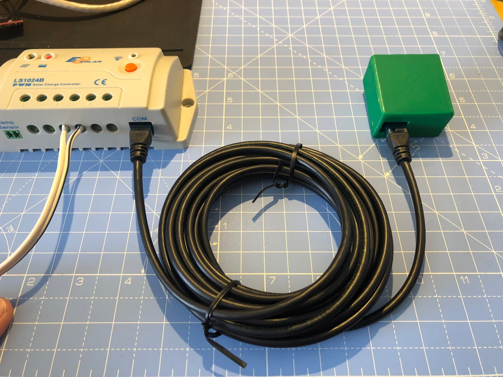

# Overview

First off thank you for your purchase! the RS485 Wifi is an evolution of the previous adaptor with a different take with regards to the connectivity and posting data to logging platforms.  The manufacturers and models has also been expanded.

*** Supported Manufacturers ***

EPEver
- Charge Controllers

- Upower Inverters

## Connecting

You shall need to use a standard RJ45 network cable, make sure it’s not a crossover.

## Choosing a firmware

There are currently two options regarding firmware which can be used.

### My custom firmware
  This is a peace of software designed by eplop which has built in wifi configuration as well as allowing you to push the data to a MQTT server as well as an influxDB.  The software also natively integrates with Home Assistant.

### ESPHome
  This will require one slight modification to the hardware but is a great way to connect.
